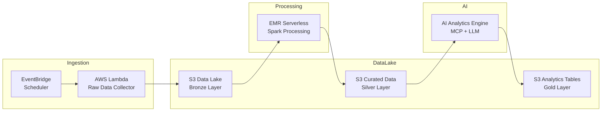

<!-- ===================== BADGES ===================== -->

---

# 🚀 AWS Data Engineering Portfolio

Production-oriented **AWS Data Engineering projects** demonstrating how modern data platforms are built in **cloud-native environments**.

Focus areas:

- **ETL / ELT pipelines**
- **Serverless data platforms**
- **Big data processing**
- **Data lake architecture**
- **Infrastructure as Code**
- **Cost-efficient cloud analytics**

Designed to simulate **real-world architectures used by global tech companies.**

---

# 🎯 Portfolio Goals

This repository demonstrates practical experience building **scalable cloud data systems** using AWS.

Each project emphasizes:

✔ Scalable architectures  
✔ Production-grade pipelines  
✔ Cost-efficient serverless design  
✔ Infrastructure automation  
✔ Clean Python engineering  

---

# 🧰 Core Tech Stack

### ☁️ Cloud Platform

### 🧠 Data Engineering

### ⚙️ Infrastructure

### 🗄️ Storage & Databases

### 🧪 Programming

---

# 📂 Featured Projects

---

# 🧠 AI-Orchestrated Big Data Analytics Pipeline

End-to-end **serverless big data pipeline** processing real-world ride-sharing datasets.

### Architecture

### Technologies

### Dataset

**NYC Taxi & Limousine Commission – HVFHS**

Ride-sharing trip data from:

- Uber
- Lyft
- Via
- Juno

Includes:

- trip distance
- timestamps
- fare breakdown
- driver earnings
- shared rides
- wheelchair accessibility

---

### Analytics Produced

The pipeline generates analytics answering:

📈 Revenue by company  
🗓️ Peak demand hours  
🚗 Average trip distance & duration  
💰 Driver earnings vs fares  
🏙️ Most profitable zones  
🛫 Airport trip impact  
♿ Accessibility usage  
👥 Shared ride adoption  

---

### Engineering Highlights

✔ **Partitioned Parquet datasets** (`year/month`)  
✔ **Spark optimizations** with column pruning  
✔ **Serverless EMR autoscaling**  
✔ **Step Functions orchestration**  
✔ **Glue metadata catalog**  
✔ **Athena analytics queries**  
✔ **AI-assisted data exploration**

📖 Project details →  
`ai-orchestrated-big-data-analytics-aws/README.md`

---

# 🤖 AI Data Lake Analytics Engine

Experimental **AI-driven data analytics layer** using **AWS MCP + LLM integration**.

### Workflow

1️⃣ Read table metadata from **Glue Catalog**  
2️⃣ AI suggests possible analytics queries  
3️⃣ User selects the analysis  
4️⃣ System generates **Gold Layer datasets**

Output:

**Analytics tables automatically generated in Parquet.**

📖 Documentation →  
`ai_data_analytics_mcp/README_AI_MCP_Lakehouse.md`

---

# ⚙️ Infrastructure as Code

Entire platform provisioned using **Terraform**.

Includes:

- Data Lake infrastructure
- EMR Serverless environment
- Step Functions workflows
- Glue Data Catalog
- IAM roles & permissions
- Lambda ingestion

Benefits:

✔ Fully reproducible infrastructure  
✔ Version-controlled cloud architecture  
✔ Fast environment deployment  

---

# 💰 Cost Optimization Strategy

All architectures prioritize **low operational cost**.

Techniques applied:

- Serverless compute
- No always-on clusters
- Partitioned Parquet storage
- Auto-scaling Spark workloads
- S3 lifecycle management

**Demo pipeline run cost:**  
≈ **$0.04 per execution**

---

# 📊 Engineering Practices Demonstrated

- Data lake architecture
- Partitioned storage design
- Idempotent ETL pipelines
- Event-driven workflows
- Cloud monitoring & logging
- Infrastructure modularization
- Security best practices (IAM least privilege)

---

# 🎯 Target Roles

This portfolio is focused on roles such as:

- **AWS Data Engineer**
- **Cloud Data Engineer**
- **Data Platform Engineer**
- **Big Data Engineer**
- **Analytics Engineer**

---

# 📬 Contact

**LinkedIn**  
https://www.linkedin.com/in/brunoaugustosouza/

**Email**  
bruno.augusto.souza@outlook.com

**Phone**  
+55 (11) 97298-3578 ([Call me on Whatsapp](https://wa.me/5511972983578))

---

⭐ If you are a recruiter or hiring manager looking for **AWS-focused Data Engineers**, feel free to explore the projects.