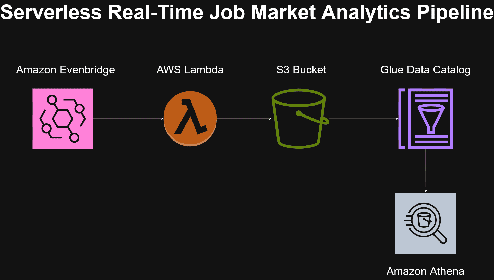

# 🚀 Serverless Data Lake Pipeline on AWS


-brightgreen)

------------------------------------------------------------------------

## 🧩 Business Problem It Solves

Many digital platforms (job marketplaces, e-commerce sites, fintech apps, SaaS products) generate large volumes of event data but struggle with:

- Monitoring trends in near real-time
- Calculating average prices or transaction values
- Tracking job postings and salary benchmarks
- Measuring event frequency and growth
- Enabling analysts to query data without engineering bottlenecks
- Keeping infrastructure costs under control

This project demonstrates how to build a scalable, cost-efficient analytics backbone to solve those problems.


# 📊 What Can Be Done With This Project?

Using this architecture, a company could:

## 💼 Job Market Monitoring

- Track number of job postings per day
- Monitor average salary by role, location, or seniority
- Identify demand trends for specific skills
- Detect sudden hiring spikes in certain industries

## 💰 Price & Revenue Analytics

- Calculate average transaction values
- Monitor revenue by event type
- Analyze user purchasing behavior
- Detect anomalies in transaction amounts

## 📈 Operational Monitoring

- Track daily event volume
- Monitor product engagement metrics
- Measure feature adoption
- Build dashboards for BI teams using Athena queries

## 🌍 Project Context

This project simulates a **production-ready, serverless data lake
architecture** designed for modern cloud-native companies in the US and
EU.

It demonstrates: 

- Event-driven ingestion;
- Columnar storage optimization (Parquet);
- Data cataloging;
- SQL analytics;
-Infrastructure as Code (Terraform);
- Cost-efficient serverless architecture

------------------------------------------------------------------------

## 🏗 Architecture Diagram



### 🔄 Data Flow

1.  Evenbridge triggers Lambda event every x minutes
2.  Lambda fetch data from public API, transforms JSON → Parquet
3.  Raw stored and curated data stored on S3
4.  Glue Data Catalog registers schema
5.  Athena enables SQL-based analytics

------------------------------------------------------------------------

## 🧠 Business Use Case

Simulates an **event-driven analytics pipeline** for a digital product
company tracking user transactions and engagement.

Example use cases: 

- Revenue tracking
- Event frequency analysis
- Behavioral segmentation
- Near real-time BI dashboards

------------------------------------------------------------------------

## ⚙️ Tech Stack

-   Amazon S3 (Data Lake Storage)
-   AWS Lambda (Serverless ETL)
-   AWS Glue Data Catalog
-   Amazon Athena
-   IAM (Least Privilege)
-   Terraform (Infrastructure as Code)
-   Python (fastparquet)

------------------------------------------------------------------------

## 📊 Example Raw Data on S3

``` json
{
  "ingestion_timestamp": "2026-02-12T21:38:20.390739",
  "source": "themuse",
  "eventapi_page_type": 1,
  "results_count":20,
  "data": {...}
}
```
You can see a sample raw file here:

👉 [View raw.json](example/s3/raw/jobs_20260212_213820.json)
------------------------------------------------------------------------

## 🔎 Example Athena Query

``` sql
SELECT 
  company, 
  COUNT(*) AS total_jobs
FROM job_analytics.jobs
GROUP BY company
ORDER BY total_jobs DESC
LIMIT 10;
```

------------------------------------------------------------------------

## 💰 Cost Efficiency

Designed for low-traffic portfolio deployment:

| Service              | Estimated Monthly Cost |
|----------------------|------------------------|
| Amazon S3            | < $2                   |
| AWS Lambda           | Free Tier              |
| Glue Data Catalog    | ~$1                    |
| Amazon Athena        | ~$1–2                  |
| **Total Estimated**  | **< $10/month**        |


------------------------------------------------------------------------
## 👨‍💻 Author

AWS Data Engineering Portfolio Project\
Generated on: 2026-02
